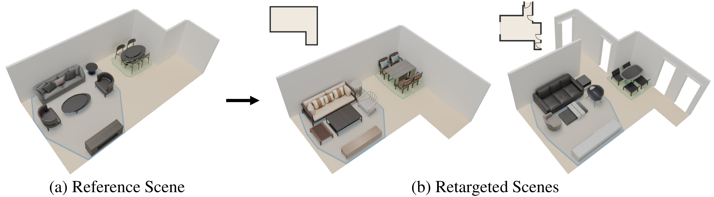

# Scene Retargeting: Learning Object Placement with Analogical Transfer

[Minkwan Kim](https://mkjjang3598.github.io) · [Junho Kim](https://www.junhokim.xyz) · [Seungmin Lee](https://veldic.github.io) · [Changwoon Choi](https://www.changwoon.info/) · [Young Min Kim](http://3d.snu.ac.kr/members)\*

Seoul National University

Code will be released soon.
